# خطة العمل الشاملة - منصة العقار الذكي 🏗️

بعد دراسة شاملة لـ **22 ملف توثيق** في `project_docs` ومقارنتها بالكود الحالي، تم تحديد جميع المميزات الناقصة والتحسينات المطلوبة. الخطة مقسمة إلى **7 مراحل** متدرجة، كل مرحلة تحتاج موافقتك قبل البدء.

---

## 📋 ملخص الفجوات (Gap Analysis)

### ما هو موجود ✅
- هيكل Flask (Routes, Models, Blueprints)
- 15 حي بيانات تجريبية + 500 عقار + 5 مطورين + 5 حدائق
- خريطة Leaflet أساسية مع 4 طبقات
- صفحة مقارنة الأحياء مع رسوم Chart.js
- Dark/Light theme toggle + Language toggle
- Scroll Reveal, Ripple Effect, Card Tilt, Number Counter
- Admin login + dashboard بسيط

### ما هو مفقود ❌

| # | الميزة المفقودة | المرجع في التوثيق |
|---|---|---|
| 1 | **UI/UX ضعيف** - تصميم بسيط لا يوحي بالفخامة، مشاكل responsive، skeleton loaders غير فعّالة | `03_design_system.md`, `14_web_ui_and_animations.md` |
| 2 | **جلب البيانات بطيء** - كل العقارات تُحمّل دفعة واحدة بدون pagination في الـ API | `15_backend_frontend_communication.md`, `16_interactive_map_system.md` |
| 3 | **GeoJSON مفقود** - الأحياء والحدائق بدون إحداثيات حقيقية (boundaries_geojson فارغ) | `05_requirements.md (FR-06)` |
| 4 | **Marker Clusters مفقودة** - عدم تجميع العقارات في الخريطة | `14_web_ui_and_animations.md`, `16_interactive_map_system.md` |
| 5 | **صفحة الإحصائيات ثابتة** - بيانات hardcoded في pages.py | `09_advanced_dashboard_metrics.md` |
| 6 | **لوحة الإدارة بدائية** - لا تحتوي على إدارة بيانات أو مراقبة النظام | `13_admin_and_auth.md` |
| 7 | **تأمين API مفقود** - لا Rate Limiting على الـ endpoints | `12_security_compliance.md` |
| 8 | **RAG/AI Chatbot مفقود** - الميزة الأساسية (FR-08) لم تُنفّذ | `08_ai_rag_strategy.md` |
| 9 | **Neighborhood Micro-Metrics** - لا توجد صفحة تفصيلية لكل حي | `09_advanced_dashboard_metrics.md` |
| 10 | **بحث متقدم** - فلتر bedrooms و min/max price لا يعمل في الواجهة | `05_requirements.md (FR-01)` |
| 11 | **صفحة العقارات** - pagination فعلي ولكن الفلاتر لا تعمل في الـ URL بشكل كامل | `04_system_workflow.md` |
| 12 | **مشاريع المطورين** - لا تظهر في صفحة المطور ولا على الخريطة | `10_developers_and_supply.md` |
| 13 | **Disclaimer وامض** - مطلوب بحسب المتطلبات ولكنه ثابت حالياً | `05_requirements.md (Legal)` |
| 14 | **Mobile responsive** - القائمة والخريطة لا تعمل بشكل سليم على الجوال | `03_design_system.md` |
| 15 | **ROI Calculator** - حساب العائد الاستثماري المفقود | `18_data_dictionary_and_math.md` |

---

## المرحلة 1: تحسين UI/UX الشامل 🎨

> **الهدف:** رفع جودة التصميم من MVP إلى Premium-grade

### الملفات المتأثرة:

#### [MODIFY] [style.css](file:///c:/Users/sulta/OneDrive/Desktop/real%20estate%20project/static/css/style.css)
- إعادة تصميم كامل لنظام الألوان مع تدرجات أكثر عمقاً
- إضافة CSS للـ Skeleton Loaders (shimmer animation) - مفقود حالياً
- تحسين responsive للجوال (navbar hamburger, map sidebar collapse, footer stack)
- إضافة Glassmorphism effects للبطاقات
- تحسين `.search-bar` بـ floating labels كما في التوثيق
- إضافة CSS للـ `.disclaimer` الوامض (blinking animation)
- إضافة تنسيقات `progress-bar` المفقودة
- تحسين `.map-wrapper` للجوال (sidebar مخفي بزر toggle)
- إضافة micro-animations للتفاعل (hover states, focus rings)
- تحسين typography: أحجام أكبر، line-height أفضل

#### [MODIFY] [base.html](file:///c:/Users/sulta/OneDrive/Desktop/real%20estate%20project/templates/layouts/base.html)
- إضافة `<meta name="theme-color">` للجوال
- تحسين الـ Navbar: إضافة hamburger menu عامل للجوال
- تحسين Footer: جعله responsive بالكامل
- إصلاح سنة الـ copyright (حالياً ثابتة `2025`)

#### [MODIFY] [interactions.js](file:///c:/Users/sulta/OneDrive/Desktop/real%20estate%20project/static/js/interactions.js)
- إصلاح skeleton loader (CSS animation مفقودة)
- إضافة tooltip custom implementation (حالياً فارغة)
- تحسين card tilt لتعمل على العناصر الديناميكية

#### [MODIFY] [index.html](file:///c:/Users/sulta/OneDrive/Desktop/real%20estate%20project/templates/pages/index.html)
- تحسين Hero section بتأثيرات بصرية أقوى
- إضافة particles/gradient animation للخلفية
- تحسين شريط البحث بـ floating labels + فلتر bedrooms و budget range
- تحسين بطاقات الأحياء والعقارات

---

## المرحلة 2: تحسين جلب البيانات والأداء ⚡

> **الهدف:** تحسين سرعة التحميل وكفاءة الـ API

### الملفات المتأثرة:

#### [MODIFY] [api.py](file:///c:/Users/sulta/OneDrive/Desktop/real%20estate%20project/app/routes/api.py)
- إضافة Pagination لـ `/api/map/properties` (حالياً `limit(500)` ثابت)
- إضافة Bounding Box filtering: `?bbox=lat1,lng1,lat2,lng2` للخريطة
- إصلاح `_get_price_history` - حالياً عشوائي عند كل طلب (يجب أن يكون ثابت)
- إضافة `/api/properties/<id>` endpoint (مفقود)
- إضافة `/api/neighborhoods/<id>/properties` endpoint
- إضافة Error handling أفضل مع رسائل عربية

#### [MODIFY] [map.js](file:///c:/Users/sulta/OneDrive/Desktop/real%20estate%20project/static/js/map.js)
- تطبيق Bounding Box fetching (جلب العقارات في المنطقة المرئية فقط)
- إضافة Leaflet.markercluster (عناقيد العقارات) - مذكور في التوثيق لكن غير مطبق
- تحسين أداء الخريطة عند التصغير/التكبير (debounce)
- إضافة loading indicator أثناء جلب البيانات

#### [MODIFY] [app.js](file:///c:/Users/sulta/OneDrive/Desktop/real%20estate%20project/static/js/app.js)
- تحسين error handling في fetch calls
- إضافة retry logic مع exponential backoff
- تحسين skeleton loader display

---

## المرحلة 3: إحداثيات GeoJSON الحقيقية + تحسين الخريطة 🗺️

> **الهدف:** إضافة حدود الأحياء والحدائق الحقيقية بدلاً من البيانات الفارغة

### الملفات المتأثرة:

#### [MODIFY] [seed_data.py](file:///c:/Users/sulta/OneDrive/Desktop/real%20estate%20project/app/utils/seed_data.py)
- إضافة GeoJSON boundaries حقيقية لكل حي من الـ 15 حي
- إضافة GeoJSON boundaries للحدائق الخمسة
- تحسين بيانات العقارات لتكون داخل حدود أحيائها فعلاً

#### [MODIFY] [map.js](file:///c:/Users/sulta/OneDrive/Desktop/real%20estate%20project/static/js/map.js)
- تحسين رسم المضلعات الحرارية (heatmap polygons) مع تدرج ألوان ديناميكي
- إضافة popup لكل حي يعرض الإحصائيات
- إضافة popup محسّن للحدائق مع معلومات المرافق
- تحسين styling المضلعات

#### [MODIFY] [map.html](file:///c:/Users/sulta/OneDrive/Desktop/real%20estate%20project/templates/pages/map.html)
- تحسين sidebar بفلاتر ديناميكية
- إضافة عداد النتائج المباشر

---

## المرحلة 4: صفحة الإحصائيات الديناميكية + Micro-Metrics 📊

> **الهدف:** تحويل الإحصائيات من ثابتة إلى ديناميكية مع صفحة تفصيلية لكل حي

### الملفات المتأثرة:

#### [MODIFY] [pages.py](file:///c:/Users/sulta/OneDrive/Desktop/real%20estate%20project/app/routes/pages.py)
- جعل بيانات الإحصائيات ديناميكية من قاعدة البيانات
- إضافة route جديد: `/neighborhood/<id>` لصفحة تفصيلية لكل حي

#### [MODIFY] [api.py](file:///c:/Users/sulta/OneDrive/Desktop/real%20estate%20project/app/routes/api.py)
- إضافة `/api/stats/neighborhood/<id>` للإحصائيات الدقيقة (Micro-Metrics)
- إضافة `/api/stats/price-trends` لبيانات الأسعار التاريخية من DB
- إضافة `/api/stats/roi` لحساب ROI ديناميكي

#### [MODIFY] [statistics.html](file:///c:/Users/sulta/OneDrive/Desktop/real%20estate%20project/templates/pages/statistics.html)
- إعادة بناء الصفحة لتجلب البيانات من الـ API
- إضافة Doughnut Chart لاستخدام الأراضي
- إضافة مقياس ROI لأبرز الأحياء
- تحسين التصميم البصري

#### [NEW] neighborhood_detail.html
- صفحة تفصيلية لكل حي تعرض:
  - جميع الـ Micro-Metrics (Facilities icon grid, Infrastructure progress bars)
  - Doughnut chart للأراضي البيضاء vs المبنية
  - قائمة العقارات المتاحة في الحي
  - خريطة مصغرة للحي

---

## المرحلة 5: تحسين لوحة الإدارة + الأمان 🔐

> **الهدف:** رفع مستوى لوحة الإدارة وتطبيق الحماية الأمنية

### الملفات المتأثرة:

#### [MODIFY] [admin_dashboard.html](file:///c:/Users/sulta/OneDrive/Desktop/real%20estate%20project/templates/pages/admin_dashboard.html)
- إضافة لوحة إحصائيات شاملة (Total props, sale/rent ratio, avg prices)
- إضافة جدول بآخر العقارات المضافة مع إمكانية الحذف
- إضافة قسم System Health Monitor
- إضافة CRUD واجهة لإدارة العقارات والأحياء

#### [MODIFY] [admin_login.html](file:///c:/Users/sulta/OneDrive/Desktop/real%20estate%20project/templates/pages/admin_login.html)
- تحسين التصميم ليبدو أكثر أماناً واحترافية

#### [MODIFY] [pages.py](file:///c:/Users/sulta/OneDrive/Desktop/real%20estate%20project/app/routes/pages.py)
- إضافة Flask-Login بدلاً من session المباشر
- إضافة حماية decorator `@login_required`
- إضافة routes لعمليات CRUD (إضافة/تعديل/حذف عقارات)

#### [MODIFY] [api.py](file:///c:/Users/sulta/OneDrive/Desktop/real%20estate%20project/app/routes/api.py)
- إضافة Flask-Limiter للـ Rate Limiting (10 req/min للـ AI, 60 req/min للخرائط)

#### [MODIFY] [requirements.txt](file:///c:/Users/sulta/OneDrive/Desktop/real%20estate%20project/requirements.txt)
- إضافة `Flask-Login`, `Flask-Limiter`

---

## المرحلة 6: صفحة المطورين + مشاريع Off-Plan المحسنة 🏗️

> **الهدف:** إثراء صفحة المطورين بالمشاريع وعرضها على الخريطة

### الملفات المتأثرة:

#### [MODIFY] [developers.html](file:///c:/Users/sulta/OneDrive/Desktop/real%20estate%20project/templates/pages/developers.html)
- إضافة قسم مشاريع كل مطور (expandable)
- إضافة Market Share pie chart
- إضافة badges: وافي، المشاريع النشطة/المسلّمة
- إضافة progress bar نسبة البيع لكل مشروع

#### [MODIFY] [seed_data.py](file:///c:/Users/sulta/OneDrive/Desktop/real%20estate%20project/app/utils/seed_data.py)
- إضافة بيانات مشاريع المطورين (DeveloperProject) - حالياً لا يوجد seed لهذا الجدول

#### [MODIFY] [api.py](file:///c:/Users/sulta/OneDrive/Desktop/real%20estate%20project/app/routes/api.py)
- إضافة `/api/developers/<id>/projects` endpoint
- إضافة developer projects كطبقة على الخريطة

#### [MODIFY] [map.js](file:///c:/Users/sulta/OneDrive/Desktop/real%20estate%20project/static/js/map.js)
- إضافة طبقة "مشاريع تحت الإنشاء" على الخريطة

---

## المرحلة 7: الشات الذكي (RAG/AI Chatbot) 🤖

> **الهدف:** تنفيذ FR-08 - المساعد الذكي للاستشارات العقارية

> [!IMPORTANT]
> هذه المرحلة تتطلب Groq API key (مجاني) ومكتبات إضافية. سنناقش التفاصيل قبل البدء.

### الملفات المتأثرة:

#### [NEW] `app/services/rag_service.py`
- تهيئة ChromaDB مع embedding model
- تحويل بيانات الأحياء والعقارات إلى vectors
- بناء retrieval pipeline

#### [NEW] `app/routes/chat.py`
- `/api/chat` endpoint يستقبل سؤال المستخدم
- يبحث في ChromaDB عن السياق المناسب
- يرسل للـ Groq API مع system prompt مخصص
- يرجع الإجابة بالعربية

#### [NEW] `templates/components/chat_widget.html`
- واجهة شات عائمة (floating widget) في كل الصفحات
- تصميم premium مع تأثيرات حركية
- عرض رسائل المستخدم والذكاء الاصطناعي

#### [MODIFY] [base.html](file:///c:/Users/sulta/OneDrive/Desktop/real%20estate%20project/templates/layouts/base.html)
- إدراج chat widget في الـ layout الأساسي

#### [MODIFY] [requirements.txt](file:///c:/Users/sulta/OneDrive/Desktop/real%20estate%20project/requirements.txt)
- إضافة `chromadb`, `sentence-transformers`, `groq`

---

## خطة التحقق (Verification Plan)

### اختبارات يدوية
- فتح كل صفحة والتأكد من عمل التأثيرات البصرية
- اختبار الخريطة مع التصغير/التكبير وتبديل الطبقات
- اختبار البحث والفلاتر
- اختبار المقارنة بين الأحياء
- اختبار لوحة الإدارة
- اختبار الشات الذكي

### اختبارات تلقائية
- تشغيل `python run.py` والتأكد من عدم وجود أخطاء
- اختبار كل API endpoint عبر المتصفح
- التأكد من عمل responsive على أحجام شاشات مختلفة

---

## ⚡ ترتيب الأولويات

```mermaid
gantt
    title خطة العمل - منصة العقار الذكي
    dateFormat X
    axisFormat %s
    
    section المرحلة 1
    تحسين UI/UX الشامل           :a1, 0, 1
    
    section المرحلة 2
    تحسين جلب البيانات والأداء     :a2, 1, 2
    
    section المرحلة 3
    GeoJSON + تحسين الخريطة       :a3, 2, 3
    
    section المرحلة 4
    إحصائيات ديناميكية + Micro-Metrics :a4, 3, 4
    
    section المرحلة 5
    لوحة الإدارة + الأمان          :a5, 4, 5
    
    section المرحلة 6
    المطورين + Off-Plan            :a6, 5, 6
    
    section المرحلة 7
    شات ذكي RAG/AI                :a7, 6, 7
```

---

## أسئلة مفتوحة

> [!IMPORTANT]
> **1.** هل تريد أن نبدأ بالمرحلة 1 (UI/UX) أم تفضل ترتيباً مختلفاً؟

> [!IMPORTANT]
> **2.** بالنسبة للمرحلة 7 (RAG/AI): هل لديك Groq API key جاهز؟ أم نستخدم بديل مجاني مثل Ollama محلياً؟

> [!NOTE]
> كل مرحلة مستقلة ولا تتطلب المرحلة التي بعدها. يمكننا تعديل الترتيب أو دمج مراحل حسب ما تراه مناسباً.
