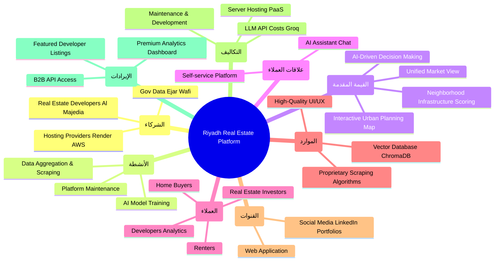

# Business Analysis (نماذج العمل والتحليل)

This document analyzes the real estate platform from a business perspective to ensure the technical implementation aligns with business goals.

## 1. SWOT Analysis (تحليل سوات)

| Strengths (نقاط القوة) | Weaknesses (نقاط الضعف) |
| :--- | :--- |
| - **Aggregated Data:** Combines Ejar, Wafi, and scraping into one unified platform. - **Interactive Map:** Advanced neighborhood grading and real urban planning layers. - **AI Integration:** RAG and decision-making models provide unique value to users. - **Modern UI:** Premium, fast, and responsive user experience. | - **Data Dependency:** Relies heavily on scraping and third-party APIs which can break or change limits. - **Cold Start:** Requires time to build a robust database of properties and historical prices. - **Hosting Limits:** Cannot be hosted on free PHP hosts (like InfinityFree), requires VPS/PaaS. |

| Opportunities (الفرص) | Threats (التهديدات) |
| :--- | :--- |
| - **Saudi Vision 2030:** Massive real estate boom in Riyadh drives high demand for data-driven platforms. - **B2B Expansion:** Can be sold or pitched to major real estate developers (Al Majedia, Raseen) as an analytics tool. - **Monetization:** Premium access for investors looking for ROI and neighborhood grading. | - **Competition:** Established giants like Aqar application dominate the market. - **Legal/Scraping Laws:** Scraping competitors' data might pose legal risks (mitigated by the disclaimer banner). - **Data Accuracy:** If scraped data is outdated, user trust drops. |

---

## 2. Business Model Canvas - BMC (نموذج العمل التجاري)

---

## 3. PESTEL Analysis (السوق العقاري السعودي)

- **Political (سياسي):** Government initiatives strongly support transparency in real estate (e.g., Ejar, Wafi, Sakani). The platform aligns perfectly with these initiatives.
- **Economic (اقتصادي):** High liquidity and investment in Riyadh real estate. Users need data to make safe financial decisions.
- **Social (اجتماعي):** A young demographic looking for digital-first solutions. High reliance on mobile apps and interactive maps for searching.
- **Technological (تكنولوجي):** Rapid adoption of AI. Integrating RAG and decision models places the platform ahead of traditional listing sites.
- **Environmental (بيئي):** Increasing interest in quality of life (QoL) - parks, walkability, and sun direction. The platform's "Infrastructure Score" and "Sun Angle" features directly address this.
- **Legal (قانوني):** Strict laws on data privacy and scraping. The platform must explicitly state it is an "Academic Demo" to avoid liability, and rely more on official APIs when possible.
