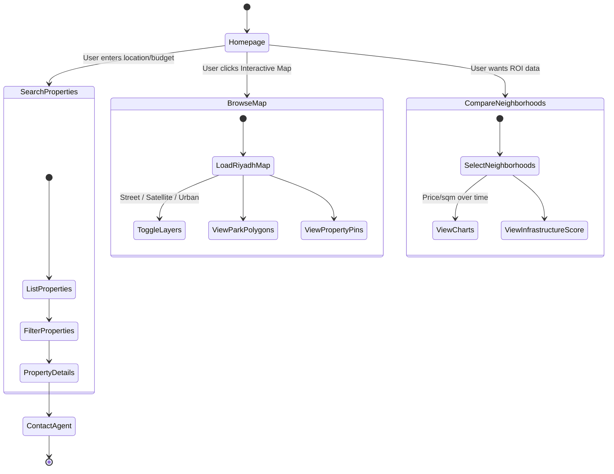
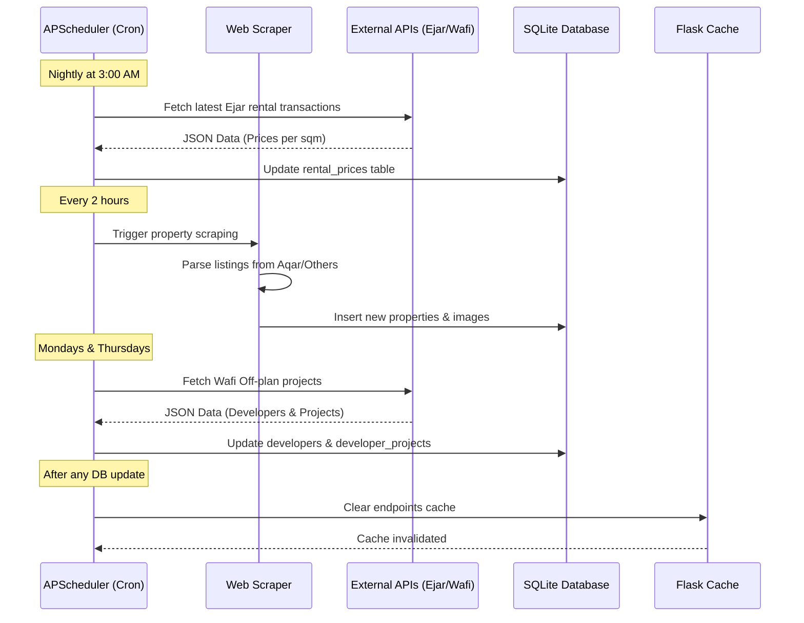

# System Workflow (طريقة عمل النظام)

This document maps out how users interact with the system and how background processes run to keep data fresh.

## 1. User Journey (دورة حياة المستخدم)

This Activity Diagram shows the standard flow of a user looking for a property or neighborhood data.

## 2. Background Data Sync (مزامنة البيانات)

To ensure the platform is always up to date without slowing down user requests, we use `APScheduler` in Flask to run background jobs.

