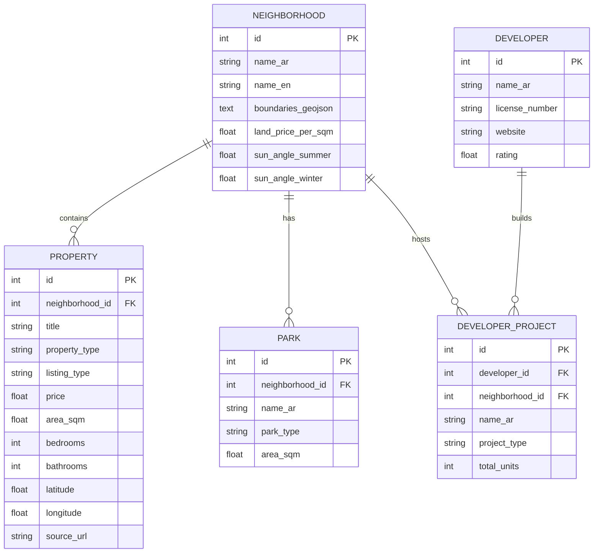

# Database & Sources (قاعدة البيانات والمصادر)

This document outlines the database schema and where the data comes from.

## 1. Data Sources (مصادر البيانات)

1. **شبكة إيجار (Ejar Network):**
   - **Type:** Government API / Data Source.
   - **Data:** Average rental prices per sqm, number of commercial vs residential leases.
   - **Reliability:** Extremely high. Used as the ground truth for rental charts.

2. **برنامج وافي (Wafi Program):**
   - **Type:** Government API / Data Source.
   - **Data:** Licensed off-plan projects and real estate developers (e.g., Al Majedia).
   - **Reliability:** Extremely high. Protects users from fraudulent developers.

3. **Web Scraping (مواقع العقار):**
   - **Type:** Automated HTML Parsing (BeautifulSoup/Selenium).
   - **Data:** Live property listings (Villas, Apartments for sale/rent).
   - **Reliability:** Medium. Subject to duplicate listings and missing data, hence the need for cleaning algorithms before inserting into the DB.

## 2. Entity-Relationship Diagram (ERD)

## 3. Database Engine
- **Current:** SQLite (`app.db`). Chosen for rapid prototyping and zero-configuration setup during the academic phase.
- **Production Recommendation:** PostgreSQL. Required when moving to Render.com and for better spatial queries (using PostGIS) if boundaries become more complex.
