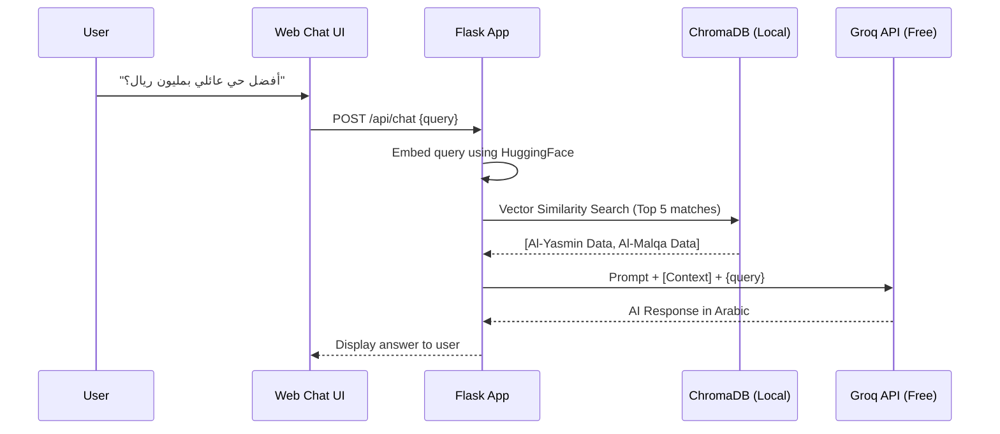

# استراتيجية الذكاء الاصطناعي (AI & RAG Strategy) 🤖

This document outlines the free, student-friendly architecture for implementing an AI assistant using Retrieval-Augmented Generation (RAG) and Machine Learning models.

## 1. RAG Architecture (هيكلة التوليد المعزز بالاسترجاع)
The goal of the RAG system is to allow users to ask questions like: *"I have 1 million Riyals and work in Olaya, where should I buy a villa?"*

- **Vector Database (قاعدة البيانات الاتجاهية):** 
  - **Tool:** `ChromaDB` (Open source, runs locally, 100% free).
  - **Embedding Model:** `all-MiniLM-L6-v2` from HuggingFace (runs locally, free).
  - **Chunking Strategy:** Real estate descriptions and neighborhood stats are chunked by logical segments (e.g., `[Neighborhood Name] - Price: [Price], Facilities: [List]`).

- **LLM Inference (النموذج اللغوي):**
  - **Tool:** `Groq API` using `Llama-3-70b-versatile` or `Mixtral-8x7b`.
  - **Why Groq?** It provides extremely fast inference and has a generous free tier perfect for academic projects.

### RAG Workflow Diagram

## 2. ML Decision Model (نموذج اتخاذ القرار)
- **Algorithm:** Decision Tree Classifier / Random Forest (via `scikit-learn`).
- **Purpose:** To predict the "Investment Score" or "Livability Score" of a property based on features (Price, Area, Sun Angle, Distance to Hospitals).
- **Hosting:** The `.pkl` model file is loaded into Flask memory at startup. No external API costs.
