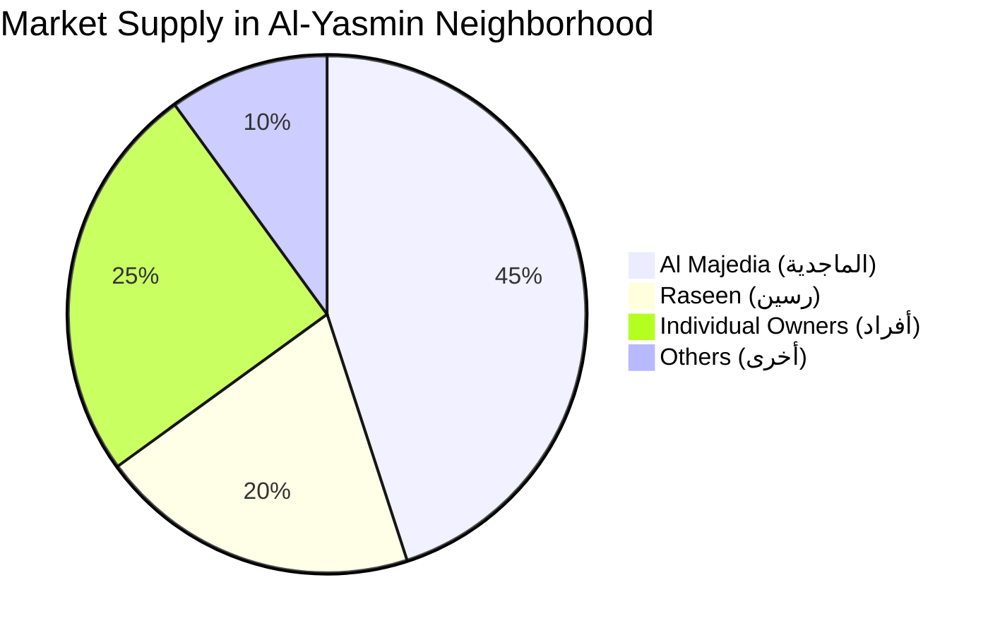

# المطورون العقاريون والعرض (Developers & Supply) 🏗️

This document explains how the platform tracks real estate developers and their market share.

## 1. Developer Profiles
Users can view detailed profiles of major developers (e.g., Al Majedia Residence, Raseen, Dar Al Arkan).
- **Data Source:** Wafi Program API + Web Scraping of the developer's official site.
- **Profile Data:** Name, License Number, Active Projects, Delivered Projects.

## 2. Market Share & Supply Tracking
The platform calculates how much of the market a specific developer controls in a given neighborhood.

## 3. Off-Plan Integration (البيع على الخارطة)
- Projects fetched from **Wafi** are flagged with an "Off-Plan" badge.
- **Metrics shown:** Expected completion date, escrow account status, and total units available.
- **Benefit:** Protects buyers by showing only officially licensed off-plan projects, increasing the platform's credibility as a reliable academic tool.
