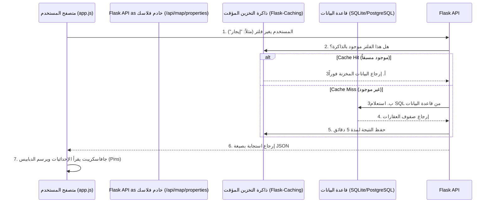

# تواصل الواجهة الأمامية مع الخلفية (Backend & Frontend Communication) 🔌

هذا الملف يوثق بالتفصيل كيف يعمل خادم `Flask` (Backend) وكيف يتحدث مع متصفح المستخدم (Frontend) لضمان عمل المشروع بكفاءة وسرعة.

## 1. نموذج الاتصال الهجين (Hybrid Rendering Model)
المشروع لا يعتمد على أسلوب واحد فقط، بل يدمج بين تقنيتين لتحقيق أفضل أداء:

### أ. العرض من جهة الخادم (Server-Side Rendering - SSR)
- **الأداة:** `Jinja2` (محرك قوالب Flask).
- **الاستخدام:** يُستخدم لبناء الهيكل الأساسي للصفحات (مثل `index.html`، `base.html`).
- **الميزة:** يضمن أن محركات البحث (SEO) تستطيع قراءة محتوى الصفحة الأساسي فوراً، ويوفر سرعة في عرض الهيكل (First Paint).

### ب. العرض من جهة العميل (Client-Side Rendering - CSR / AJAX)
- **الأداة:** JavaScript `fetch()` API.
- **الاستخدام:** يُستخدم لجلب البيانات الثقيلة والمتغيرة (مثل بيانات الخريطة، العقارات، والإحصائيات) *بعد* تحميل الصفحة.
- **الميزة:** يسمح بتحديث أجزاء من الشاشة (مثل تحريك الخريطة أو تطبيق فلتر بحث) دون الحاجة لإعادة تحميل الصفحة بالكامل.

---

## 2. هيكلة مسارات الاتصال (Routing Structure)
تم تقسيم الـ Backend في مجلد `app/routes/` إلى قسمين مفصولين تماماً:

### 1. مسارات الصفحات (`pages.py`)
- **الوظيفة:** ترجع ملفات HTML للمستخدم.
- **أمثلة:** 
  - `GET /` ⬅️ ترجع `index.html`
  - `GET /map` ⬅️ ترجع `map.html`

### 2. مسارات البيانات (`api.py`)
- **الوظيفة:** ترجع بيانات بصيغة `JSON` فقط لتستهلكها نصوص الجافاسكريبت.
- **أمثلة (API Contracts):**

#### 📍 نقطة جلب العقارات للخريطة (Properties API)
- **Endpoint:** `GET /api/map/properties`
- **Query Params:** `?property_type=villa&listing_type=sale`
- **Response Format (JSON):**
```json
{
  "success": true,
  "count": 120,
  "data": [
    {
      "id": 1,
      "title": "فيلا فاخرة بحي الياسمين",
      "lat": 24.8188,
      "lng": 46.6288,
      "price_formatted": "1,500,000 ريال",
      "bedrooms": 4
    }
  ]
}
```

#### 📍 نقطة جلب مضلعات الأحياء (Neighborhoods GeoJSON)
- **Endpoint:** `GET /api/map/neighborhoods`
- **Response Format (JSON):** ترجع مصفوفة تحتوي على `boundaries` بصيغة GeoJSON ليرسمها مكتبة `Leaflet.js` كملونات حرارية (Heatmaps).

---

## 3. دورة حياة الطلب (Request Lifecycle)
إليك كيف يتم طلب بيانات العقارات وعرضها في الخريطة:



## 4. الحماية والتخزين المؤقت في الـ Backend
- **التخزين المؤقت (Caching):** لأن استعلامات الخرائط ثقيلة (تحسب إحداثيات ومئات العقارات)، تم استخدام `Flask-Caching`. إذا قام ألف مستخدم بفتح الخريطة في نفس الدقيقة، الخادم يقرأ من قاعدة البيانات مرة واحدة فقط، ويخدم الـ 999 الآخرين من الذاكرة (RAM) بلمح البصر.
- **ضغط البيانات (GZIP):** يقوم الـ Backend بضغط ملفات הـ JSON الكبيرة قبل إرسالها للـ Frontend عبر `Flask-Compress`، مما يقلل استهلاك باقة الإنترنت للمستخدم ويسرع ظهور النقاط على الخريطة.
